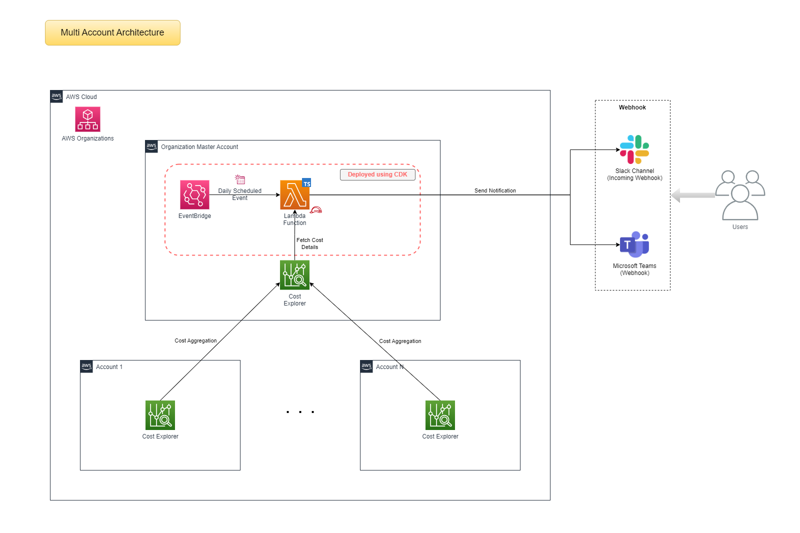
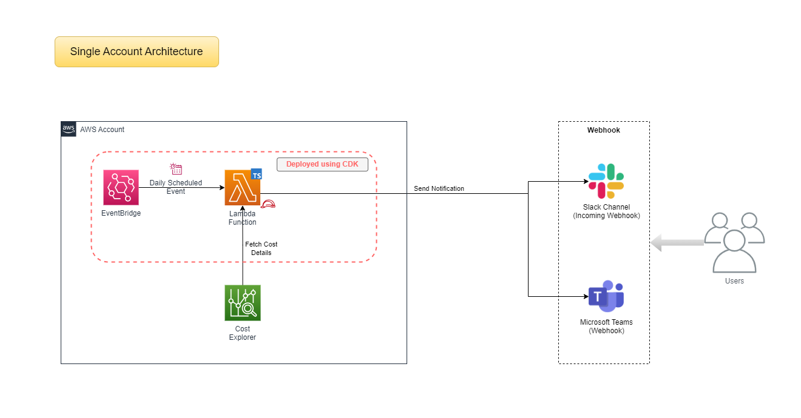
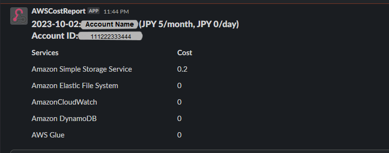
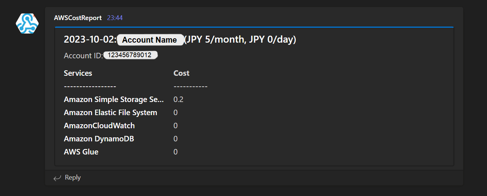

# AWS Cost Report

**AWS Cost Report** is a serverless application designed to automate the process of collecting AWS costs from Cost Explorer, organized by services, and sending notifications to Slack or Teams at a specified time daily. It is developed using TypeScript and deployed as an AWS Lambda function. The application can be deployed individually on AWS accounts or in the Master Account of an Organization aggregating costs from child accounts.

## Solution Architecture

### Multi-Account


### Standalone Account



## Components:

- **AWS Lambda Function:**

  The core functionality of the application is implemented within an AWS Lambda function.
  This Lambda function fetches daily cost data using the AWS Cost Explorer API.
  It formats the cost information based on the specified accounts and currency.
  The Lambda function constructs a notification message and sends it to the configured Slack or Microsoft Teams channel.

- **AWS CloudWatch Events Rule:**

  A CloudWatch Events rule is scheduled to trigger the Lambda function daily at a specific time (8 am JST or 23:00 UTC).
  When triggered, the CloudWatch Events rule invokes the Lambda function to collect the cost data.

- **External Notification Platforms (Slack or Microsoft Teams):**

  The application sends notifications to the specified Slack or Microsoft Teams channel.
  Slack or Microsoft Teams webhook URLs are configured in the application to facilitate message delivery.
　　

## Outputs

#### Slack Notification


#### Teams Notification


## Configuration

The application can be configured using the following options in the `/app/src/config/config.json` file:

| Configuration Attribute | Description                                                                  | Value Options                                                                                                                                   |
| ----------------------- | ---------------------------------------------------------------------------- | ----------------------------------------------------------------------------------------------------------------------------------------------- |
| accountIds              | List of AWS account IDs for which notifications will be sent.                | Array of AWS account IDs (For Multi-account Architecture),  Array with 1 account ID (For Single-account Architecture)                           |
| currency                | The preferred currency for cost calculations.                                | Currency codes available at Open Exchange Rates (e.g., JPY, INR, etc.)                                                                          |
| timeZoneOffset          | Timezone offset in hours and minutes.                                        | Object with "hours" and "minutes" properties denoting time offset from UTC (e.g., Japan Standard Time is UTC +09:00 {"hours": 9, "minutes": 0}) |
| notificationPlatform    | The platform for notifications (slack or teams).                             | "slack" or "teams"                                                                                                                              |
| webhookUrl              | Webhook URL for the Slack or Teams channel where notifications will be sent. | Valid Slack or Teams webhook URL                                                                                                                |

Example 1: Multi Account with Teams:
```json
{
  "accountIds": ["123123123123", "111222333444"],
  "currency": "JPY",
  "timeZoneOffset": {
    "hours": 9,
    "minutes": 0
  },
  "notificationPlatform": "teams",
  "webhookUrl": "https://test.webhook.office.com/webhookb2/aa111aa1a-1111-1a11-11a1-11a1a1a1111@111a1a11-a1a1-1111-1111-11a1a1a11a11/IncomingWebhook/111111111111111111111111/a1a1a1-a1a1-1aa1-a1a1-11a111aa1111"
}
```

Example 2: Standalone Account with Slack:
```json
{
  "accountIds": ["123123123123"],
  "currency": "INR",
  "timeZoneOffset": {
    "hours": 5,
    "minutes": 30
  },
  "notificationPlatform": "slack",
  "webhookUrl": "https://hooks.slack.com/services/A111AA11A1/A11AAAAA111/aAaA1aaaaaa1aAaaaaAA1aA1"
}
```


## Pre-requisites:

Before deploying the AWS Cost Report application, ensure you have the following prerequisites in place:

- Node.js and npm installed on your local machine.
- AWS CDK installed globally (npm install -g aws-cdk).
- AWS CLI configured with the necessary IAM permissions.
- AWS accounts or organization details where you want to collect cost data.
- Slack or Microsoft Teams webhook URL for receiving notifications.


## Deployment

To deploy the application, follow these steps:

1. Clone the repository: 
   ```sh
   git clone https://github.com/ibatulanandjp/aws-cost-report.git
   ```

2. Configure the application at `/app/src/config/config.json` by referring to above configuration details.

3. Configure AWS CLI to use the profile or set credentials for the account, which you want to deploy the application into.
   ```sh
   export AWS_PROFILE=<aws-profile-name>
   ```

   (For more details, see [reference](https://docs.aws.amazon.com/cli/latest/userguide/cli-chap-configure.html))

   You can confirm this by running the following command:
   ```sh
   aws sts get-caller-identity
   ```
   
4. Synthesize CloudFormation templates:
   ```sh
   npm run synth
   ```

5. Deploy the application:
   ```sh
   npm run deploy
   ```

   **Note:** 
   
   In case, you are deploying CDK Stack for the first time in the AWS account, it would ask you to bootstrap your account (which is a one-time activity). 
   To bootstrap your account, run the command:
   ```sh
   cdk bootstrap aws://ACCOUNT-NUMBER/REGION
   ```

   For more details, see [reference](https://docs.aws.amazon.com/cdk/v2/guide/bootstrapping.html), and the deployment after bootstrap should complete successfully. 


The application will be deployed to your AWS environment, and the specified notifications will be sent daily at the configured time.

#### Other available commands
1. Check diff of the stack after making any change:
   ```sh
   npm run diff
   ``` 

## Clean Up

To clean up the environment, run the following command:
```sh
npm run destroy
```
